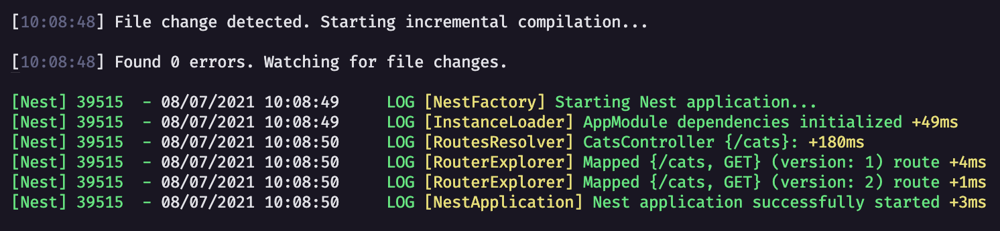
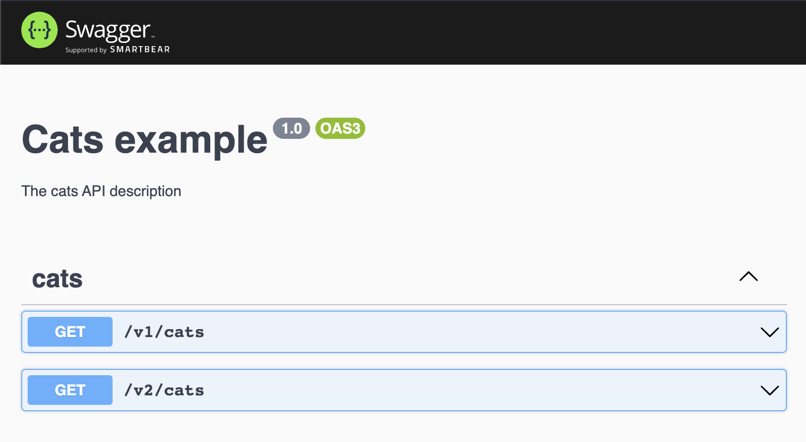

# nestjs-v8-playground

> Repository for testing version 8 of NestJS

## Key-Features

- 🔥 better API versioning
- ⚡ lazy-loading modules & serverless docs
- 🍒 logger refactor & improvements

## Screenshots

Logger refactor

Swagger integrated with new API versioning:

